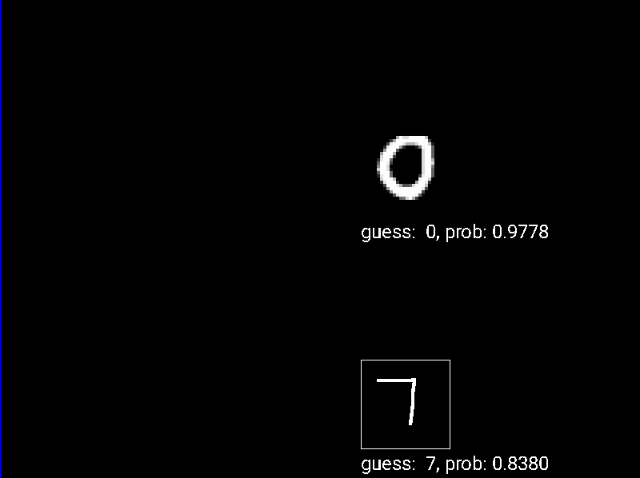

# NN

This is a library for creating deep neural networks in c, there are some neural networks that I implemented. The purpose of this project is just to learn how simple neural networks work.

## Features

You can train and save the neural network to a file.

## Examples

The examples are in the main folder.

### xor

It's just a simple neural network that learns the xor function, as is a simple function the nn gets a 100% accuracy.

### MNIST

This is a neural network to recognize the [mnist](https://en.wikipedia.org/wiki/MNIST_database) number dataset. The example has to read a lot of images, so it needs time to start. After some training the nn gets only 80% of accuracy, note that it uses the sigmoid function for everything which is not the best and there's nothing parallelized.

Bidings:
| key | action |
| --- | --- |
| enter| prediction of the written number on the canvas. |
| r | prediction of a random number of the dataset. |
| t | tests the nn and prints (on the terminal) the accuracy obtained in the training set and the testing set |

## Usage

compile using `make`, this will compile all the examples.
